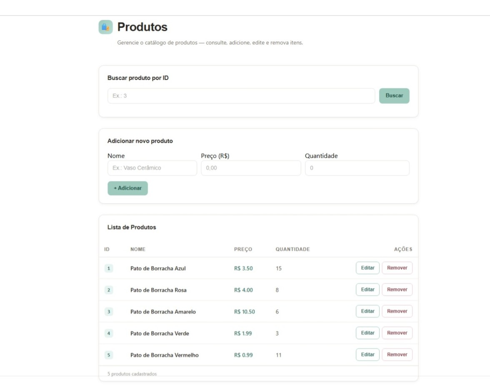

<div align="center">


### Aplicação de cadastro de produtos com Angular, ASP.NET Core e SQLite


</div>

## Sobre o projeto

Projeto de integração entre uma aplicação **Angular** e uma **API REST em ASP.NET Core**. A interface permite consultar e manter produtos; a API aplica as regras de negócio e persiste os dados em um banco SQLite usando Entity Framework Core.

O repositório reúne as duas aplicações:

| Pasta | Conteúdo |
| --- | --- |
| [`Produtos-FrontEnd`](Produtos-FrontEnd/README.md) | Interface Angular e chamadas HTTP para a API |
| [`Produtos-BackEnd`](Produtos-BackEnd/README.md) | API .NET, operações CRUD e persistência SQLite |

## Prévia

<p align="center">
  
</p>

## Funcionalidades

- Listar produtos cadastrados.
- Buscar um produto pelo ID.
- Cadastrar produto com nome, preço e quantidade.
- Editar um produto existente.
- Remover um produto.
- Validar dados e impedir nomes duplicados na camada de serviço.

## Tecnologias

- **Front-end:** Angular, TypeScript, RxJS e HttpClient.
- **Back-end:** .NET 10, ASP.NET Core Web API, C# e Entity Framework Core.
- **Banco de dados:** SQLite.
- **Documentação da API:** Swagger em ambiente de desenvolvimento.

## Executar localmente

É necessário ter o .NET 10 SDK, Node.js e npm instalados. Inicie cada aplicação em um terminal separado.

### 1. Iniciar a API

```bash
cd Produtos-BackEnd
dotnet restore
dotnet ef database update
dotnet run
```

Se o comando `dotnet ef` não estiver instalado, instale a ferramenta uma vez:

```bash
dotnet tool install --global dotnet-ef
```

A API usa `http://localhost:5027` no perfil HTTP. A interface Swagger fica disponível em [`http://localhost:5027/swagger`](http://localhost:5027/swagger) enquanto a API está em desenvolvimento.

### 2. Iniciar a interface

Em outro terminal, a partir da raiz do repositório:

```bash
cd Produtos-FrontEnd
npm install
npm start
```

Abra [`http://localhost:4200`](http://localhost:4200). O serviço Angular está configurado para consumir `http://localhost:5027/api/produto`; mantenha a API em execução. O back-end permite chamadas CORS dessa origem local.

## Estrutura

```text
Projeto_API_dotnet/
├── Produtos-BackEnd/
│   ├── Controllers/       # Endpoints HTTP
│   ├── Data/              # DbContext
│   ├── Migrations/        # Migrações do Entity Framework Core
│   ├── Models/            # Entidades
│   ├── Repositories/      # Acesso a dados
│   └── Services/          # Regras de negócio
└── Produtos-FrontEnd/
    └── src/app/
        ├── components/    # Interface de produtos
        └── services/      # Integração HTTP com a API
```

## Fluxo da aplicação

```text
Angular (localhost:4200) → HTTP / CORS → ASP.NET Core (localhost:5027) → Entity Framework Core → SQLite
```

<div align="center">


Desenvolvido como exercício prático de integração front-end e back-end.


</div>
